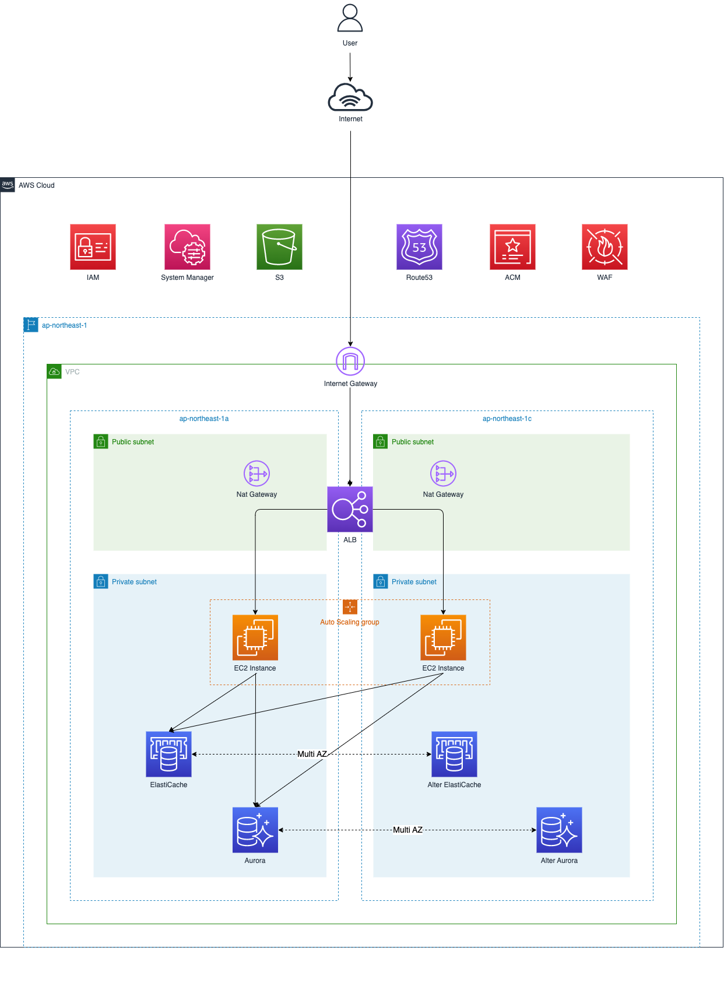

# terraform-scalable-template

## Overview

This repository contains terraform template for scalable architecture.

&emsp;

## Diagram



&emsp;

## Required

- [AWS CLI](https://aws.amazon.com/cli) - v2 or later
- [Terraform](https://www.terraform.io/downloads.html) - v1 or later

&emsp;

## Getting Started

Clone this repository.

```shell
$ cd ~ && git clone https://github.com/tsukuboshi/terraform-scalable-template
```
